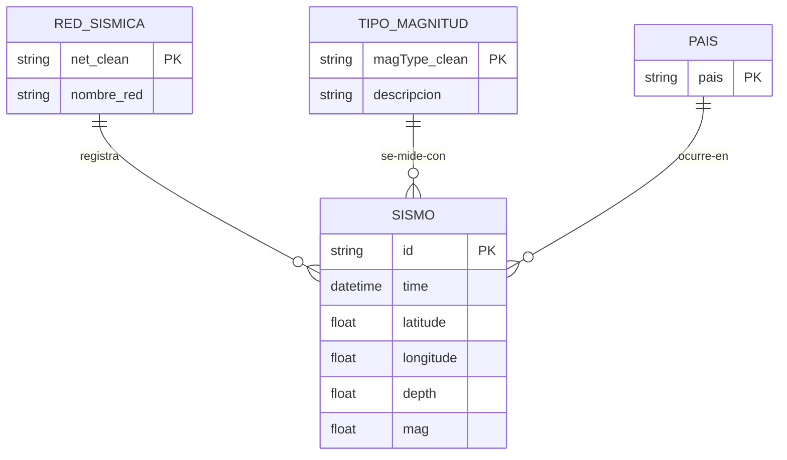

# Práctica 2 - Estadística Descriptiva (Justificaciones)

El script de esta práctica es `Estadistica_Descriptiva.py`. Los resultados están en las capturas de ejecución del repositorio; además, el script guarda los boxplots en `img/` y la tabla agrupada en `csv/`.

La metodología sigue el material de referencia de la materia (`data_analysis.org`): funciones de agregación, álgebra relacional, crear categorías a partir de texto (como su función `categorize()`), `groupby + agg`, boxplots y tablas con `tabulate`.

---

## 1. Categoría nueva: `pais`

Como la columna `place` es texto libre, no se podía agrupar directamente por país. Por eso se creó la categoría `pais` con una función propia (`categorize_pais`), inspirada en el `categorize()` del material de referencia.

Al hacerla hubo que considerar casos especiales del texto:
- `"New Mexico"` termina en `"Mexico"` pero es un estado de EEUU, así que se excluyó para no clasificarlo como México.
- `"Revilla Gigedo Islands region"` y `"Gulf of California"` no dicen "Mexico" aunque son zona mexicana, así que se les puso una regla propia.
- Los registros de Baja California vienen como `"B.C."` o `", MX"` y tampoco terminan en "Mexico", por lo que se detectan aparte.

---

## 2. Estadística descriptiva

### `describe()` y los porcentajes (25%, 50%, 75%)
Esos porcentajes no son valores al azar: salen de ordenar todos los datos de menor a mayor y marcar posiciones. El 25% es el valor que deja atrás a una cuarta parte de los datos, el 50% es justo la mitad (la mediana) y el 75% deja atrás tres cuartas partes. 
Sirven para ver la forma de los datos sin que los extremos engañen, por ejemplo, si la mediana queda mucho menor que la media, es señal de que hay pocos valores muy grandes jalando el promedio hacia arriba.

### Las 10 funciones de agregación
Se aplicaron las diez que lista el material de la materia (min, max, moda, conteo, sumatoria, media, varianza, desviación estándar, asimetría y kurtosis). Algunas aclaraciones:
- La sumatoria de la magnitud no tiene un significado físico real; se dejó solo para ver el funcionamiento de la función.
- La moda sí resulta informativa aquí: cuando el valor más repetido coincide con un "tope" del catálogo o con un valor por defecto (como la profundidad que asigna el USGS cuando no la puede calcular), la moda lo deja ver.
- La asimetría y la kurtosis ayudan a ver si los datos están cargados hacia un lado con cola larga y si hay valores extremos; en profundidad era de esperarse una cola larga por los sismos profundos de subducción.

---

## 3. Entidades y relaciones

Una entidad es un objeto o concepto que se puede describir con datos propios. Se identificaron cuatro entidades principales (SISMO, PAIS, RED_SISMICA y TIPO_MAGNITUD) y tres secundarias.

### Por qué las secundarias se quedaron como secundarias
| Entidad | Justificación |
| --- | --- |
| FUENTE_MAGNITUD (`magSource`) | Casi siempre coincide con la red que registró el sismo, pero hay casos donde una red registra y otra calcula la magnitud. Es casi redundante, pero deja documentado que registro y cálculo pueden separarse. |
| REGIÓN | Es un nivel más fino que PAIS (Texas, California, Baja California...). Podría servir para análisis más detallados, pero para no complicar el modelo se mantuvo el nivel país. |
| MES | No es una entidad "objeto" sino la dimensión temporal; es la base de las agregaciones por tiempo. |

Las relaciones son uno a muchos (1:N): un país tiene muchos sismos, una red registra muchos sismos, un tipo de magnitud mide muchos sismos. En el script cada relación se demuestra con sus conteos reales.

El JOIN (`merge`) se usó para combinar la información del sismo con la red y el tipo de magnitud en una sola tabla.

### Diagrama Entidad-Relación (entidades principales)

Las secundarias no se dibujaron en el diagrama para mantenerlo sencillo, pero sí se generan en el script.

---

## 4. Álgebra relacional

Se aplicaron selección, proyección, unión, JOIN, agrupación y transposición. En corto: la selección filtra filas según una condición, la proyección elige columnas, la unión apila registros de dos conjuntos, el JOIN combina tablas por una columna en común, la agrupación resume por categoría y la transposición cambia la orientación de la tabla para poder leerla más cómodo.

---

## 5. Métricas de datos agrupados

Con las agrupaciones por país, red, tipo de magnitud y año se ve cómo cambian el número de sismos, sus magnitudes y sus profundidades entre categorías. La idea es que las diferencias entre zonas queden visibles (por ejemplo, zonas con muchos sismos pequeños y superficiales frente a zonas con pocos pero más profundos), y de paso estas tablas sirven de base para prácticas siguientes.

---

## 6. Archivos generados

| Archivo | Por qué se guarda |
| --- | --- |
| `csv/analizado_pais_anio.csv` | Es la tabla agrupada por país y año; queda disponible para reutilizarla sin volver a correr esa parte del análisis. |
| `img/boxplot_pais.png`, `img/boxplot_red.png` | Los diagramas de caja dejan comparar la distribución de magnitudes entre categorías de un vistazo. |

---

## 7. Notas y referencias

1. El último año del rango está incompleto, así que su conteo sale menor que el de un año completo; no es un error de los datos.
2. Las profundidades negativas se conservan desde la Práctica 1 con su justificación (datum/elevación del USGS); no son sismos "flotando".
3. La columna `profundidad_estimada` marca las profundidades que son valor por defecto del USGS cuando no la puede calcular; viene de la Práctica 1 y queda por si algún modelo futuro quiere filtrarlas.
4. Referencias consultadas para el formato y el diagrama:
   - https://tutorialmarkdown.com/blog/markdown-en-github (tablas y texto en GitHub)
   - https://www.youtube.com/watch?v=V5GdRPIJ4-c&t=179s (diagrama entidad-relación)
   - https://www.ionos.com/digitalguide/websites/web-development/python-pandas-dataframe-describe/ (información metodo describe())
