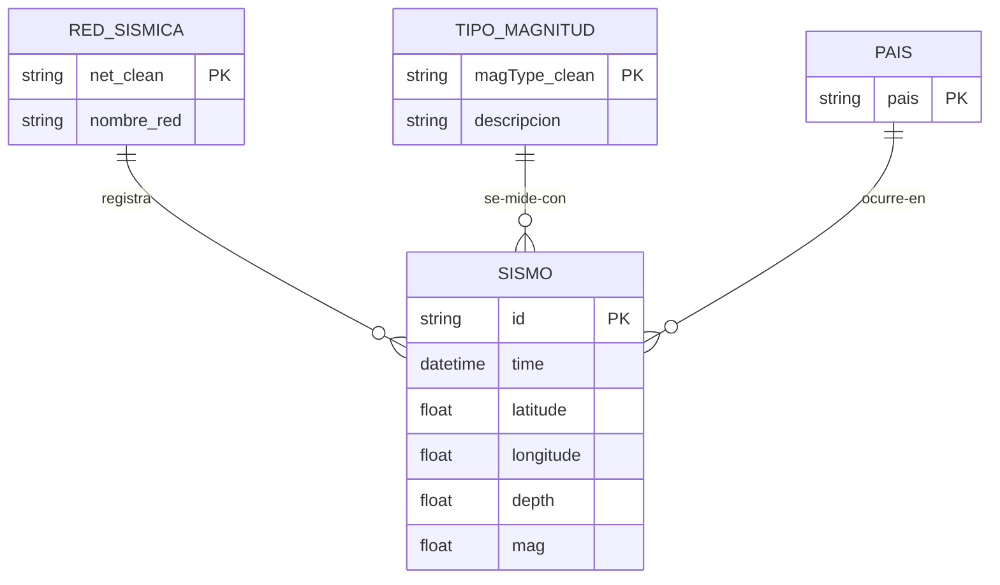

# Práctica 2 –-- Estadística Descriptiva: Justificaciones

**Script:** el archivo `Estadistica_Descriptiva.py` corresponde a esta practica. 
**Resultados:** ver capturas de ejecución adjuntas en el repositorio (el script imprime todas las tablas y guarda boxplots en `img/` y la tabla agrupada en `csv/`).
**Metodología:** basada en el material de referencia (`data_analysis.org`): funciones de agregación, álgebra relacional, creación de categorías desde texto (como su `categorize()`), `groupby + agg`, boxplots y tablas con `tabulate`.

---

## 1. Categoría nueva: `pais` (función `categorize_pais`)

La columna `place` es texto libre ("51 km SSE of Whites City, New Mexico"), por lo que no se puede agrupar directamente. Se crea la categoría `pais` imitando el `categorize()` (esto tomando como referencia el archivo data_analysis.org en las referencias de github).

**Decisiones con "trampas" del texto que hubo que considerar:**
- `"New Mexico"` también **termina en** `"Mexico"`, pero es un estado de EEUU, entonces se excluye explícitamente para no clasificarlo como México.
- `"Revilla Gigedo Islands region"` y `"Gulf of California"` no contienen la palabra "Mexico", pero son territorio/aguas mexanas, entonces  se asignan a México para no perderlos como EEUU.
- Los formatos `"B.C."` y `", MX"` (Baja California) no terminan en "Mexico", entonces se detectan con reglas propias.

---

## 2. Estadística descriptiva: qué significa cada cosa

### `describe()` y los porcentajes (25%, 50%, 75%)
No son valores arbitrarios: salen de **ordenar todos los datos de menor a mayor y marcar posiciones**. El 25% es el valor que deja atrás a una cuarta parte de los datos; el 50% es justo la mitad (la **mediana**); el 75% deja atrás tres cuartas partes. Sirven para ver la **forma** de los datos sin que los valores extremos engañen: si la mediana es mucho menor que la media, es señal de que hay pocos valores muy grandes que "jalan" el promedio hacia arriba.

### Las 10 funciones de agregación del profesor
Se aplican las diez (min, max, moda, conteo, sumatoria, media, varianza, desviación estándar, asimetría y kurtosis) porque son las que el material de la materia lista. Dos notas conceptuales:
- **La sumatoria de la magnitud no tiene sentido físico** (sumar magnitudes no significa nada); se incluye únicamente como ejercicio de la función, igual que en el material de referencia.
- **La moda es informativa en este dataset:** cuando el valor más repetido coincide con un "tope" o "valor por defecto" del catálogo (por ejemplo, la magnitud mínima registrada o la profundidad por defecto que asigna el USGS cuando no puede calcularla), la moda lo delata.
- **Asimetría y kurtosis** indican si los datos están cargados hacia un lado con cola larga, y si existen valores extremos (outliers); en profundidades se espera cola larga por los sismos profundos de subducción.

---

## 3. Entidades y relaciones

Una **entidad** es un objeto del mundo real con datos propios. Se identifican cuatro entidades **principales** (SISMO, PAIS, RED_SISMICA y TIPO_MAGNITUD) y tres **secundarias**.

### Por qué las secundarias son secundarias
| Entidad | Justificación |
| --- | --- |
| FUENTE_MAGNITUD (`magSource`) | Casi siempre coincide con la red que registró el sismo, pero **existen casos donde una red registra y otra calcula la magnitud**. Es casi redundante, pero documenta que registro y cálculo pueden separarse. |
| REGIÓN | Es un nivel más fino que PAIS (Texas, California, Baja California...). Útil para análisis detallados futuros, para simplificar las cosas lo mantenemos a nivel paises. |
| MES | No es una entidad "objeto" sino la **dimensión temporal**; es la base de las agregaciones por tiempo. |

Las relaciones son **uno a muchos (1:N)**: un país *tiene* muchos sismos, una red *registra* muchos sismos, un tipo de magnitud *mide* muchos sismos, etc. El script demuestra cada relación con conteos reales.

El **JOIN** (`merge`) cruza el sismo con sus entidades para tener en una sola tabla el nombre de la red y la descripción del tipo de magnitud, como en una base de datos relacional.

### Diagrama Entidad-Relación (entidades principales)

Las entidades secundarias no se dibujan en el diagrama principal para mantenerlo simple y defendible, pero quedan en el script con sus relaciones por si en prácticas futuras se requiere mayor detalle.

---

## 4. Álgebra relacional

En esta sección se aplicaron las operaciones básicas del álgebra relacional sobre el dataset, con el objetivo de ver la misma información desde distintos enfoques:

Se aplicó la **selección** para conservar únicamente las filas que cumplen una condición (los sismos de magnitud alta), lo que permite ver solo el subconjunto de interés sin el ruido del resto de los registros. Se aplicó la **proyección** para quedarnos únicamente con algunas columnas, mostrando una vista reducida de la tabla con la información relevante sin perder filas. Se aplicó la **unión** para apilar en un solo conjunto los sismos de dos países, viendo la región completa como una única tabla en lugar de partes separadas. Se aplicó el **join** para cruzar la tabla de sismos con las tablas de entidades (red sísmica y tipo de magnitud), viendo cada sismo con su nombre de red y descripción. Se aplicó la **agrupación** para resumir los sismos por categoría, viendo conteos y medidas por grupo en lugar de registros individuales. Y se aplicó la **transposición** para reacomodar la tabla de estadísticas descriptivas, viendo cada variable como una fila para facilitar su lectura.

---

## 5. Métricas de datos agrupados (qué se espera ver)

Agrupar por país, red, tipo de magnitud y año no es solo un ejercicio: **las métricas agrupadas cuentan la historia geológica de los datos**. Se espera que revelen el contraste entre zonas de sismicidad *inducida* (muchos sismos pequeños y superficiales, típicos de la actividad de extracción en Texas) y zonas de *subducción* (pocos sismos pero más fuertes y profundos, en Centroamérica y el Pacífico mexicano), así como que los tipos de magnitud usados para sismos grandes (momento sísmico) concentren las magnitudes altas.

---

## 6. Archivos generados y por qué

| Archivo | Justificación |
| --- | --- |
| `csv/analizado_pais_anio.csv` | Deja la tabla agrupada como entregable y reutilizable (por si se llegara a necesiatar). (`analyzed_uanl.csv`).  |
| `img/boxplot_pais.png`, `img/boxplot_red.png` | Los diagramas de caja permiten comparar la distribución de magnitudes entre categorías de un vistazo. |

---

## 7. Notas a considerar y referencias

1. **El último año del rango está incompleto** (solo tiene parte del año): su conteo anual se ve artificialmente bajo comparado con años completos; no es un error de los datos.
2. **Profundidades negativas:** se conservan desde la Práctica 1 con justificación (referencia de elevación/datum del USGS); no son sismos "flotando".
3. **Categoría `other`** en las columnas `*_clean`: agrupa los casos raros para que las prácticas estadísticas y de clasificación trabajen con grupos suficientemente grandes; puede excluirse si se desea comparar solo categorías principales.
4. **`profundidad_estimada`:** marca las profundidades que son valor por defecto del USGS (cuando no puede calcularla), heredadas de la Práctica 1, para que los modelos futuros puedan filtrarlas si lo requieren.
5. Para redactar la justificación de la practica anterior y esta (y para futuras practicas) se emplea la información de estas paginas:
https://tutorialmarkdown.com/blog/markdown-en-github (Para el formato de tablas y texto) 
https://www.youtube.com/watch?v=V5GdRPIJ4-c&t=179s (Para el diagrama entidad-relación)
