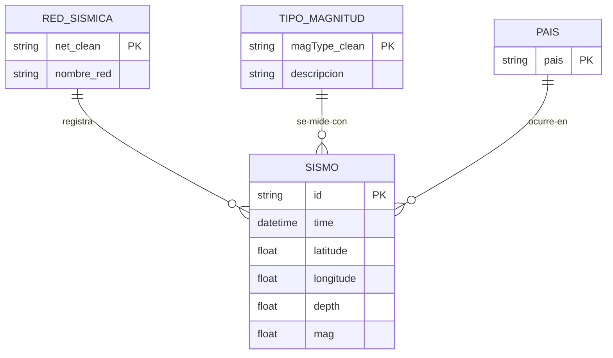

# Práctica 2 –-- Estadística Descriptiva: Justificaciones

**Script:** el archivo `Estadistica_Descriptiva.py` corresponde a esta practica. 
**Resultados:** ver capturas de ejecución adjuntas en el repositorio (el script imprime todas las tablas y guarda boxplots en `img/` y la tabla agrupada en `csv/`).
**Metodología:** basada en el material de referencia (`data_analysis.org`): funciones de agregación, álgebra relacional, creación de categorías desde texto (como su `categorize()`), `groupby + agg`, boxplots y tablas con `tabulate`.

---

## 1. Categoría nueva: `pais` (función `categorize_pais`)

La columna 'place' contiene texto libre, por lo que primero fue necesario crear una categoría de país para poder agrupar los datos. Se crea la categoría `pais` imitando el `categorize()` (esto tomando como referencia el archivo data_analysis.org en las referencias de github).

**Casos especiales que se tuvieron que considerar:**
- `"New Mexico"` también **termina en** `"Mexico"`, pero es un estado de EEUU, así que se excluye de esa condición para evitar clasificarlo como México.
- `"Revilla Gigedo Islands region"` y `"Gulf of California"` no contienen "Mexico", por lo que se agregaron reglas específicas para clasificarlos como México.
- Los formatos `"B.C."` y `", MX"` (Baja California) no terminan en "Mexico", entonces se detectan con reglas propias.

---

## 2. Estadística descriptiva: qué significa cada cosa

### `describe()` y los porcentajes (25%, 50%, 75%)
No son valores al azar, salen de **ordenar todos los datos de menor a mayor y marcar posiciones**. El 25% es el valor que deja atrás a una cuarta parte de los datos, el 50% es justo la mitad (la **mediana**), el 75% deja atrás tres cuartas partes. Sirven para ver la **forma** de los datos sin que los valores extremos engañen: si la mediana es mucho menor que la media, es señal de que hay pocos valores muy grandes que "jalan" el promedio hacia arriba.

### Las 10 funciones de agregación del profesor
Se aplicaron las diez (min, max, moda, conteo, sumatoria, media, varianza, desviación estándar, asimetría y kurtosis) porque son las que el material de la materia lista. Algunas consideraciones:
- **La sumatoria de la magnitud no tiene sentido físico** se incluye solo para ver su funcionamiento.
- **La moda es informativa en este dataset:** cuando el valor más repetido coincide con un "tope" o "valor por defecto" del catálogo (por ejemplo, la magnitud mínima registrada o la profundidad por defecto que asigna el USGS cuando no puede calcularla), la moda lo delata.
- **Asimetría y kurtosis** indican si los datos están cargados hacia un lado con cola larga, y si existen valores extremos (outliers); en profundidades se espera cola larga por los sismos profundos de subducción.

---

## 3. Entidades y relaciones

Una **entidad** representa un objeto o concepto que puede describirse mediante datos propios. Se identificaron cuatro entidades **principales** (SISMO, PAIS, RED_SISMICA y TIPO_MAGNITUD) y tres **secundarias**.

### Por qué las secundarias son secundarias
| Entidad | Justificación |
| --- | --- |
| FUENTE_MAGNITUD (`magSource`) | Casi siempre coincide con la red que registró el sismo, pero **existen casos donde una red registra y otra calcula la magnitud**. Es casi redundante, pero documenta que registro y cálculo pueden separarse. |
| REGIÓN | Es un nivel más fino que PAIS (Texas, California, Baja California...). Útil para análisis detallados futuros, para simplificar las cosas lo mantenemos a nivel paises. |
| MES | No es una entidad "objeto" sino la **dimensión temporal**; es la base de las agregaciones por tiempo. |

Las relaciones son **uno a muchos (1:N)**: un país *tiene* muchos sismos, una red *registra* muchos sismos, un tipo de magnitud *mide* muchos sismos, etc. El script demuestra cada relación con conteos reales.

El **JOIN** (`merge`) permite combinar la información del sismo con la red y el tipo de magnitud en una sola tabla.

### Diagrama Entidad-Relación (entidades principales)

Las entidades secundarias no se incluyen en el diagrama principal para mantenerlo más sencillo, sin embargo, sí se generan en el script.

---

## 4. Álgebra relacional

Se aplicaron **selección, proyección, unión, JOIN, agrupación y transposición**. La selección filtra filas según una condición, la proyección selecciona columnas, la unión combina registros de dos conjuntos, el JOIN combina tablas mediante una columna común, la agrupación resume los datos por categoría, y la transposición cambia la orientación de la tabla de resultados.

---

## 5. Métricas de datos agrupados (qué se espera ver)

Las métricas agrupadas permiten comparar el número de sismos, sus magnitudes y profundidades entre países, redes, tipos de magnitud y años. Estas agrupaciones permiten comparar las características de los sismos entre las distintas zonas y categorías del dataset.

---

## 6. Archivos generados y por qué

| Archivo | Justificación |
| --- | --- |
| `csv/analizado_pais_anio.csv` | Contiene la tabla agrupada por país y año y permite reutilizar los resultados sin volver a ejecutar esa parte del análisis.  |
| `img/boxplot_pais.png`, `img/boxplot_red.png` | Los diagramas de caja permiten comparar la distribución de magnitudes entre categorías de un vistazo. |

---

## 7. Notas a considerar y referencias

1. **El último año del rango está incompleto**, por lo que su conteo es menor que el de años completos.
2. **Profundidades negativas:** se conservan desde la Práctica 1 con justificación (referencia de elevación/datum del USGS); no son sismos "flotando".
3. **`profundidad_estimada`:** marca las profundidades que son valor por defecto del USGS (cuando no puede calcularla), heredadas de la Práctica 1, para que los modelos futuros puedan filtrarlas si lo requieren.
4. Para la elaboración de esta justificación (y la anterior) se consultaron las siguientes referencias:

https://tutorialmarkdown.com/blog/markdown-en-github (Para el formato de tablas y texto)

https://www.youtube.com/watch?v=V5GdRPIJ4-c&t=179s (Para el diagrama entidad-relación)
